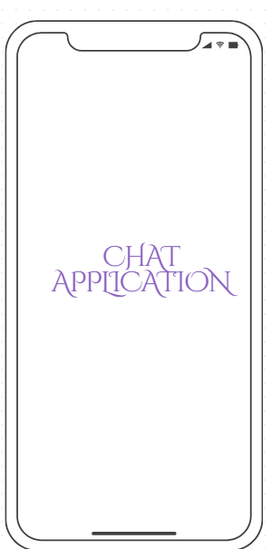

# Real-time-chat-application

## Overview
It allows users to communicate through text, images and files through text, images and files with authentication ,online/offline  status.

## Project objective
- To develop a secure chat application.
- To communicate instantly;
- It provides one-on-one and group chat functionality.

## Project workflow

 - **User Signup/Login**: Users register with their details and log in with credentials.
 
- **Authentication Validation**: Verify user credentials and grant access.

- **Online/Offline Status**: Update user status when they log in or out.

- **Message Sending**: User sends a message; the system checks recipient status.

- **Message Delivery**: Deliver messages instantly if online; store them if offline.

- **Typing Indicator**: Show "typing…" when a user starts typing.

- **Notifications**: Notify users of new messages when online or upon re-login.

- **Admin Login**: Admin logs in to monitor activities.

- **Admin Monitoring**: Admin can view active users.
- 
- ## layout images

 

